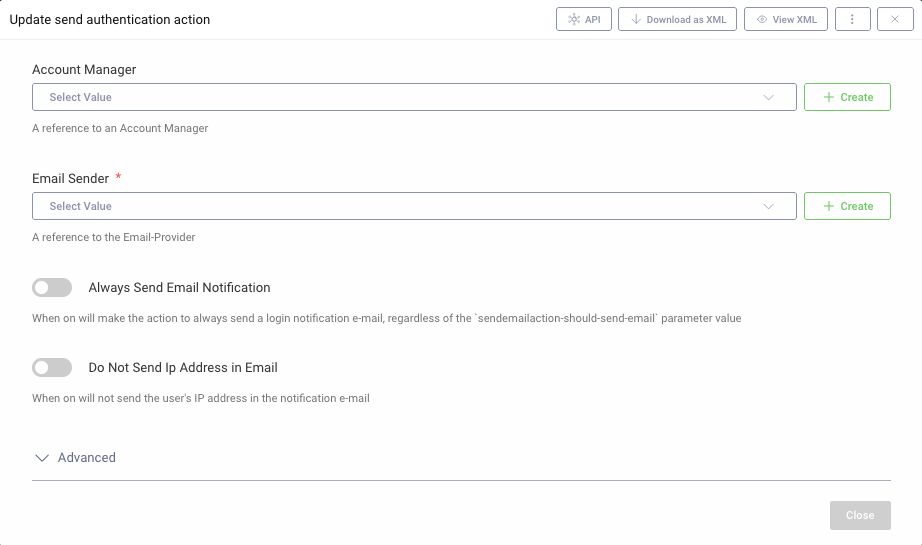

SendEmailAction Authentication Action Plugin
=============================================

.. image:: https://img.shields.io/badge/quality-demo-red
   :target: https://curity.io/resources/code-examples/status/
   :alt: Quality

.. image:: https://img.shields.io/badge/availability-source-blue
   :target: https://curity.io/resources/code-examples/status/
   :alt: Availability

A custom authentication action plugin for the Curity Identity Server. You can add the action to any authenticator to send
an e-mail to the user whenever the given authenticator is used in the login or SSO flow. The e-mail will contain the
username, time of login, the user-agent used to log in and, optionally, the IP address from which the login was initiated.

Building the Plugin
~~~~~~~~~~~~~~~~~~~

Build the plugin by issuing the command ``mvn package``. This will produce a JAR file in the ``target`` directory,
which can be installed.

Installing the Plugin
~~~~~~~~~~~~~~~~~~~~~

To install the plugin, copy the compiled JAR (and all of its dependencies) into the :file:`${IDSVR_HOME}/usr/share/plugins/${pluginGroup}`
on each node, including the admin node. For more information about installing plugins, refer to the `curity.io/plugins`_.

The plugin uses templates for the e-mail as well as localized messages inside those templates. To use templates and the
provided text, copy those files accordingly:

- templates from the `/templates` directory to :file:`${IDSVR_HOME}/usr/share/templates/overrides/`
- messages from the `messages` directory to :file:`${IDSVR_HOME}/usr/share/messages/overrides/`

Required Dependencies
"""""""""""""""""""""

You need at least version 5.2. of the Curity Identity Server to use this plugin.

For a list of the dependencies and their versions, run ``mvn dependency:list``. Ensure that all of these are installed in
the plugin group. Otherwise, they will not be accessible to this plug-in and run-time errors will result.

Customizing the Plugin
~~~~~~~~~~~~~~~~~~~~~~

If you want to customize the e-mail sent by the plugin you can change the messages and template files provided in this
repository. Refer to the `curity.io/templates`_ for more information on overriding templates.

Configuring the Plugin
~~~~~~~~~~~~~~~~~~~~~~

There are a few options you can configure for the plugin:

- Account Manager: You can provide an account manager which will be used to retrieve the user's email address. If you omit
  this option the plugin will assume that you use e-mails as usernames and will use the username as the recipients address.

- Email Sender: You must provide a valid e-mail sender which will be responsible for sending the e-mails.

- Always send e-mail notification: If `on` then the plugin will always send an e-mail notification for the given authenticator.
  If `off` then the plugin will look for a parameter `sendemailaction-should-send-email`, and send the e-mail only if its
  value is `true` (you can set this parameter using other actions).

- Do Not Send Ip Address in Email: When `on` will _not_ include the user's IP address in the notification e-mail. By default
  the IP address is included in the e-mail.

More Information
~~~~~~~~~~~~~~~~

Please visit `curity.io`_ for more information about the Curity Identity Server.

.. _curity.io/plugins: https://developer.curity.io/docs/latest/developer-guide/plugins/index.html#plugin-installation
.. _curity.io: https://curity.io/
.. _curity.io/templates: https://developer.curity.io/docs/latest/developer-guide/front-end-development/overview.html#understanding-the-templating-system
